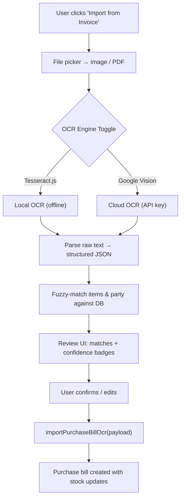

# OCR Invoice Import Feature — Implementation Flow

## Goal

Accept a **purchase invoice image/PDF**, extract supplier & item data via OCR, fuzzy-match against the DB, let the user review/confirm, and atomically import using the existing [importPurchaseBillFromOcr()](file:///Users/shivam/Documents/vyapar-clone/src/main/db.js#1303-1494) backend.

---

## Architecture



---

## Sample Invoice Structure (Reference)

Based on the provided invoice (`Adobe Scan 1 Mar 2026.pdf`):

| Field | Example |
|---|---|
| **Supplier** | JAI BALAJI TRADING CO. |
| **GST** | 07AAOFJ5649L1ZN |
| **Bill No** | SB-2526-17876 |
| **Date** | 11/02/2026 |

**Item columns:** Sr · QTY · PACK · PARTICULARS · HSN CODE · Batch No · Exp (MM/YY) · MRP · Rate · DIS% · CGST% · SGST% · AMOUNT

> [!NOTE]
> The parser must handle this column layout. CGST + SGST are combined to derive the total GST rate (e.g. 2.5% + 2.5% = 5%). Expiry dates are in `MM/YY` format and must be normalised to `YYYY-MM-DD`.

---

## Proposed Changes

### Component 1 — OCR Service (Main Process)

#### [NEW] [ocrService.js](file:///Users/shivam/Documents/vyapar-clone/src/main/ocrService.js)

Two OCR backends behind a unified API:

```
extractTextFromImage(imagePath, engine = 'tesseract')
  → engine='tesseract': uses tesseract.js (npm) — runs offline, no API key
  → engine='google':    uses Google Cloud Vision REST API — needs API key stored in app settings
```

- **PDF handling**: Uses `pdf-poppler` or `pdf-to-img` to convert PDF pages to PNG before OCR.
- **`parseInvoiceText(rawText)`** — Heuristic parser tuned for the sample invoice layout:
  - Identifies supplier block (name, GST, address, phone) from the top section.
  - Finds invoice number & date from header fields.
  - Detects item table by locating header row keywords (`QTY`, `PARTICULARS`, `BATCH`, `HSN`, `MRP`, `RATE`, `AMOUNT`).
  - Parses each subsequent row into structured line items.
  - Combines CGST% + SGST% → single `gst_rate`.
  - Normalises expiry `MM/YY` → `YYYY-MM-DD` (last day of month).
  - Strips currency symbols, collapses whitespace, normalises numbers.

**Output shape:**
```json
{
  "supplier": { "name": "...", "phone": "...", "gst_number": "...", "address": "..." },
  "bill": { "invoice_no": "...", "order_date": "YYYY-MM-DD" },
  "items": [
    { "item_name": "...", "hsn": "...", "qty": 0, "rate": 0, "amount": 0,
      "batch_no": "...", "expiry_date": "YYYY-MM-DD", "mrp": 0, "gst_rate": 0,
      "pack": "...", "discount_pct": 0 }
  ]
}
```

---

### Component 2 — Fuzzy Matching Service (Main Process)

#### [NEW] [matchingService.js](file:///Users/shivam/Documents/vyapar-clone/src/main/matchingService.js)

- **`matchParty(ocrSupplier, dbParties)`**
  - Priority: exact GST number match → normalised name similarity (dice coefficient).
  - Returns `{ matched, confidence, candidates[] }`.

- **`matchItems(ocrItems, dbItems)`** — Per item returns:
  - `action: "matched"` (confidence ≥ 0.85) — auto-linked
  - `action: "review"` (0.5 ≤ confidence < 0.85) — user picks from candidates
  - `action: "create_new"` (confidence < 0.5) — no good match

- Uses a ~30-line **dice-coefficient** string similarity function (no external dependency).

---

### Component 3 — IPC & Preload

#### [MODIFY] [main.js](file:///Users/shivam/Documents/vyapar-clone/src/main/main.js)

New IPC handlers:

| Channel | Description |
|---|---|
| `ocr:processImage` | OCR + parse → structured JSON |
| `ocr:matchEntities` | Fuzzy match extracted data against DB |
| `ocr:setApiKey` | Store/retrieve Google Vision API key |

#### [MODIFY] [preload.js](file:///Users/shivam/Documents/vyapar-clone/src/preload/preload.js)

New `window.vyapar` APIs:
- `processInvoiceImage(imagePath, engine)` → `ocr:processImage`
- `matchInvoiceEntities(ocrData)` → `ocr:matchEntities`
- `setOcrApiKey(key)` / `getOcrApiKey()` → `ocr:setApiKey`

---

### Component 4 — OCR Import Page (Renderer)

#### [NEW] [OcrImport.jsx](file:///Users/shivam/Documents/vyapar-clone/src/renderer/pages/OcrImport.jsx)

**3-step wizard:**

| Step | UI |
|---|---|
| **1 — Upload** | File picker (image/PDF). OCR engine toggle (Tesseract / Google Vision). API key input if Google selected. Image preview. "Process" button. |
| **2 — Review & Match** | **Supplier section**: matched party with confidence badge, searchable dropdown to change, or "Create New" option. **Items table**: each row shows OCR-extracted name, best DB match (dropdown), batch, expiry, MRP, HSN, qty, rate — all editable. Confidence badges: 🟢 ≥ 0.85 · 🟡 ≥ 0.5 · 🔴 < 0.5. Image preview panel visible for cross-reference. |
| **3 — Confirm** | Summary of creates/updates. "Import" button → calls [importPurchaseBillOcr()](file:///Users/shivam/Documents/vyapar-clone/src/preload/preload.js#27-28) → navigates to new order. |

#### [NEW] [OcrImport.css](file:///Users/shivam/Documents/vyapar-clone/src/renderer/pages/OcrImport.css)

Styles: step indicator, drop zone, confidence badges, review table, image preview.

---

### Component 5 — Routing & Navigation

#### [MODIFY] [App.jsx](file:///Users/shivam/Documents/vyapar-clone/src/renderer/App.jsx)

Add: `<Route path="/orders/import-ocr" element={<OcrImport />} />`

#### [MODIFY] [Orders.jsx](file:///Users/shivam/Documents/vyapar-clone/src/renderer/pages/Orders.jsx)

Add "Import from Invoice" button in page header → navigates to `/orders/import-ocr`.

---

### New Dependencies

| Package | Purpose |
|---|---|
| `tesseract.js` | Local/offline OCR engine |
| `pdf-poppler` or `pdf-to-img` | Convert PDF pages to images for OCR |

> [!NOTE]
> Google Vision API uses a simple `fetch()` call to `https://vision.googleapis.com/v1/images:annotate` — no SDK package needed.

---

## Verification Plan

### Manual Testing

1. Run `npm run dev`, navigate to Orders → "Import from Invoice"
2. Upload `Adobe Scan 1 Mar 2026.pdf`
3. Toggle between Tesseract and Google Vision — verify extraction
4. Verify supplier "JAI BALAJI TRADING CO." matched/created correctly
5. Verify all 7 items extracted with correct batch, expiry, MRP, HSN, qty, rate
6. Edit a match, change a field, import
7. Confirm order created in Orders list with correct stock updates
